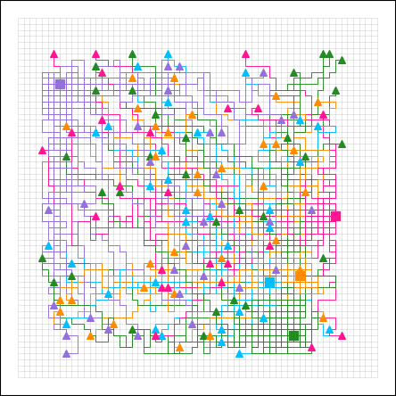
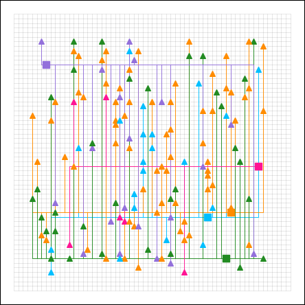
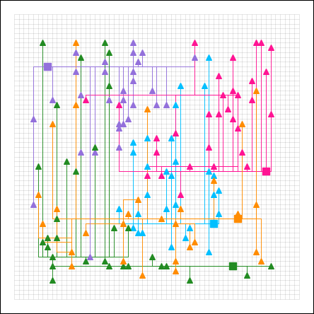
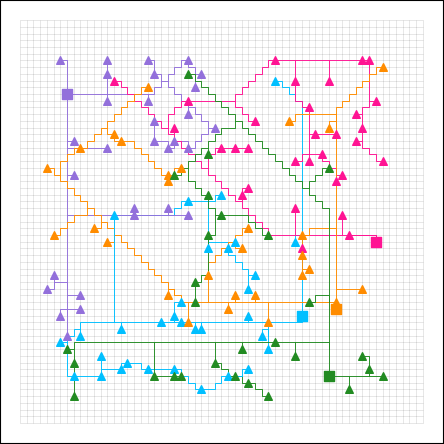
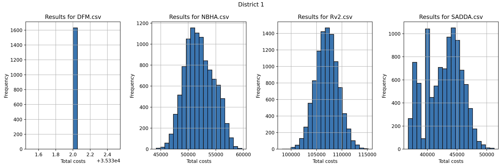
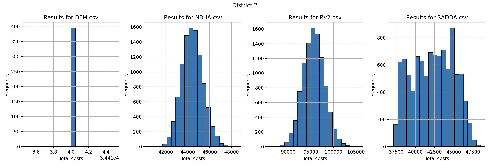
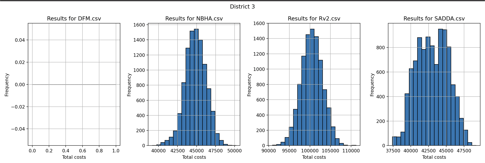

# Team RAM - Project SmartGrid
## Mercedez van der Wal // Rembrand Ruppert // Yessin Radouane


## Description
*Green energy is the energy of the future, and producing it yourself is the fashion of today. Many houses nowadays have solar panels, wind turbines or other installations to produce energy themselves. Fortunately, these installations often produce more than is needed for own consumption. The surplus could be sold back to the supplier, but the infrastructure (the grid) is often not designed for this. Batteries must be installed to manage peaks in consumption and production.
SmartGrid is a problem that describes a district with these houses and batteries placed on a grid. A solution to this problem is a scenario where all houses are connected to the batteries.*


## Requirements
To run this program, the user needs to have a working version of python installed and download and unzip the 'ram_ah' folder.
After this, the user needs to install the required packages, listed in 'requirements.txt'.
The user now needs to open the 'ram_ah' directory in the preferred code editor.

For more information regarding the command line use `python main.py --help`. To run an algorithm use `--algo "name_algorithm" --district "district_number"`. Optional: use `--plot` to make a plot of the results.

Here's an example how it works:
```
python main.py --algo SADDA --district 1 --plot
```

We are using the given data of districts 1-3. District 0 and test have been used for our own experimenting purposes.


## Algorithms
To find an efficient solution to our problem, we have implemented several algorithms.

- ### Random v2 Algorithm (baseline 2.0)
    - RWA combines a greedy and random algorithm. It combines all the houses to a random battery. Then for connections, there are 3 directions possible every step as the fourth will put you back where you came from. It will filter out the worst move and make a random choice between the left-over two choices. It will have seperate cable to every house, this means a cable cannot connect to another cable. 

- ### Depth First Mycelium Algorithm
    - DFM tries to connect all houses with their closest battery while respecting the maximum capacities of the batteries. If this is not possible, then it will simulate a swap between any 2 houses and their respective batteries to see if the swap makes room for the unconnected house to be connected as well. If this works it starts making the paths. If there is no swap to be made like in district 2, we consider this algorithm as non-efficient and will be left out in comparisons against other algorithms. If the connections are made, the algorithm finds paths in a way that resembles how a mycelium moves. It finds the furthest house connected to a battery, let's call this house A. Then, it finds a house thats furthest from house A and also connected to the same battery. Two main cables are made from the battery to each of the houses. It resumes to find the next furthest house from the battery and connect it to its closest cable or battery if it is closer than any cable.

- ### Nearest-Battery Heuristic Algorithm -- 
    - NBHA starts with a random house and looks for the closest battery. Then it looks for the closest path to the battery. The closest path will be compared to creating a new path. Based on this, the cables will be placed. If there is no closer path, there comes a new path. This algorithm takes the maximum capacity of the batteries into account. If it’s not possible to assign a house to a battery due ineffeciency in distribution of capacity, another house will be disconnected until all the house have a valid connection. This algorithm is based on our own heuristics.

- ### Smart Allocated Density Districts Algorithm 
    - SADDA uses a self built K-means clustering algorithm that creates the same number of batteries randomly placed 'centriods', and in a loop finds the nearest houses, gets a new mean position for each centroid, and repeats this process a random amount of times to eventually find 'sub-districts', each connected to a single battery. It creates an array that indicates which houses are assigned to which battery. A cable path is then placed from each house to its corresponding battery, and after all cables have been placed, the algorithm goes over all paths and eliminates overlapping cable segments for cables that connect to the same battery.


## Best results after 10k iterations for each algorithm on each district
In the last weeks we have worked on 4 different algorithms to find an optimal solution for connecting houses with given batteries while respecting the maximum capacities of the batteries.
After running many iterations we have stored the best runs and their data. These were the best results in 10k iterations:

- ### Random v2 Algorithm (Rv2):
    
    - Best score district 1: 98242
    - Best score district 2: 86299
    - Best score district 3: 90871

    This algorithm is our baseline. It connects houses to a battery and chooses a semi-random path to it. As you can see the costs are all very high and it is not guaranteed that batteries will not overload. Not the best way to connect the houses it shows.

- ### Smart Allocated Density Districts Algorithm (SADDA)
    
    - Best score district 1: 36781
    - Best score district 2: 37132
    - Best score district 3: 37402

    As you can see this is a very consistent algorithm. It works good on all districts and has very respectable costs. With the datapoints we have gathered it seems to get more expensive over the districts. We suspect this is because the algorithm finds more complexity in district 3 than district 2. Both of these seem more complex than district 1.

- ### Nearest-Battery Heuristic Algorithm (NBHA)
    
    - Best score district 1: 44161
    - Best score district 2: 40507
    - Best score district 3: 39175

    This is another well working algorithm. It works on all districts. This algorithm seems to work better in districts where SADDA finds more complexity. Although SADDA still performs slightly better. It yields around half the cost of the baseline while also ensuring batteries are not overloading.

- ### Depth-First Mycelium Algorithm (DFM)
    
    - Best score district 1: 35332
    - Best score district 2: 34414
    - Best score district 3: x

    This algorithm seems to perform the best out of the others on district 1 and 2. It uses a depth-first like approach to find the paths. Though, it fails to find a way to connect the houses while respecting battery capacities in district 3. It can possibly be improved by adding more layers in depth.


- ## Results of All Algorithms per District - Visualised
- ### District 1:
    

- ### District 2:
    

- ### District 3:
    


## Conclusion:
We have created algorithms that have at least 2x the efficiency than our base algorithm in every district. We are happy with the progress we made.
